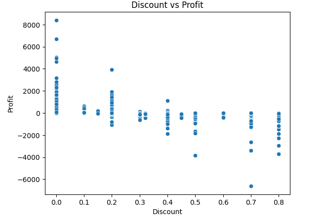
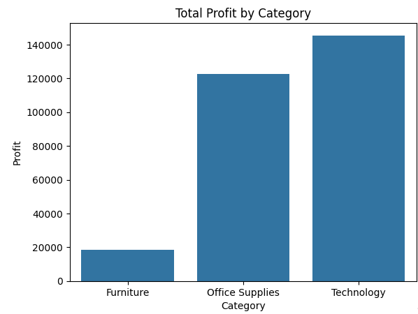
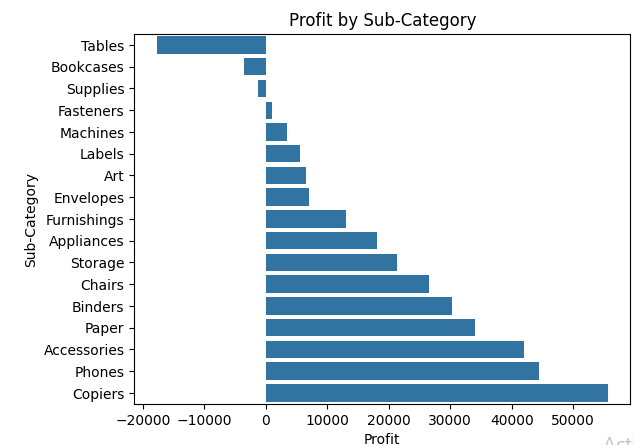
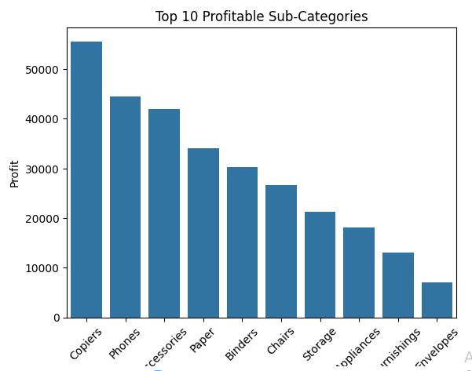

# Superstore-Sales-Analysis

## Project Overview

This project analyzes the Sample Superstore dataset to identify sales trends, profitability drivers, and business opportunities.

## Tools Used

- Python
- Pandas
- NumPy
- Matplotlib
- Seaborn
- Jupyter Notebook

## Dataset

The dataset contains 9,994 retail transactions across multiple regions, customer segments, and product categories.

## Key Findings

### 1. West Region Generates Highest Profit

- Profit: $108,418
- Lowest average discount (10.9%)

### 2. Technology is the Most Profitable Category

- Profit: $145,455

### 3. Tables are Loss-Making

- Profit: -$17,725
- Average Discount: 26.1%

### 4. Copiers Generate Highest Profit

- Profit: $55,618

### 5. Discount Negatively Impacts Profit

- Correlation = -0.219

## Visualizations

### Discount vs Profit

### Profit by Category

### Profit by Sub-Categories

### Sales by Region
.png)

### Top 10 Profitable Sub-Categories

